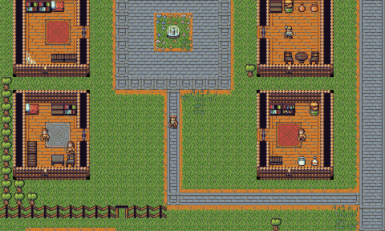

# Rotten Soup


## Build Setup

``` bash
# install dependencies
npm install

# serve with hot reload at localhost:8080
npm run dev

# build for production with minification
npm run build
```

Rotten Soup is roguelike written in JavaScript with [rot.js](http://ondras.github.io/rot.js/hp/). I used [Vue.js](https://vuejs.org/) and [Vuetify](https://vuetifyjs.com/) to build the UI. Throughout the summer I'll continue to release as much content as I can and see where it goes. Special thanks to DragonDePlatino and DawnBringer who created the free tileset, Dawnlike, that I use for Rotten Soup.

# Controls
- Movement is 8-directional using either the numpad or vim keys. You may also use the arrow-keys for 4-directional movement.
```
         y k u   7  8  9
         \ | /    \ | /
         h-+-l    4-5-6
         / | \    / | \
         b j n    1 2 3
         vi-keys   numpad
```

- You can move up and down ladders using `>` (down) and `<` (up).
- You can rest for a turn with `.` or `5` on the numpad.
- You can pick up items with `,` or `g`.

# Current Features
*Note: A lot of the features below (like dungeon generation and FOV) come from built-in ROT.js methods*
- Field of view / Fog of war
- Minimap, revealed as you explore
- Static overworld map
- Randomly generated dungeons
- Transitions between overworld and dungeons with persistent maps
- Inventory system and items
- Simple AI for Goblins and Rats
- Graphical tiles

# Future Goals
- Skills 
- Distinct Regions of Overworld map
- Over-arching simple quest (e.g collect the 4 diamonds from the 4 regions)
- Abilites, ranged combat, and magic combat
- Noise for dungeon generation
- Unique random generation for different sections
- Shop with items
- Friendly NPC's
- Ability to swap between ASCII and Graphical tiles
- More enemy types with stronger AI and unique abilities

# Contact / Feedback
If you have any feedback, please send me an email at larkenx@gmail.com or drop an issue on GitHub. Any feedback is welcome and greatly appreciated.
