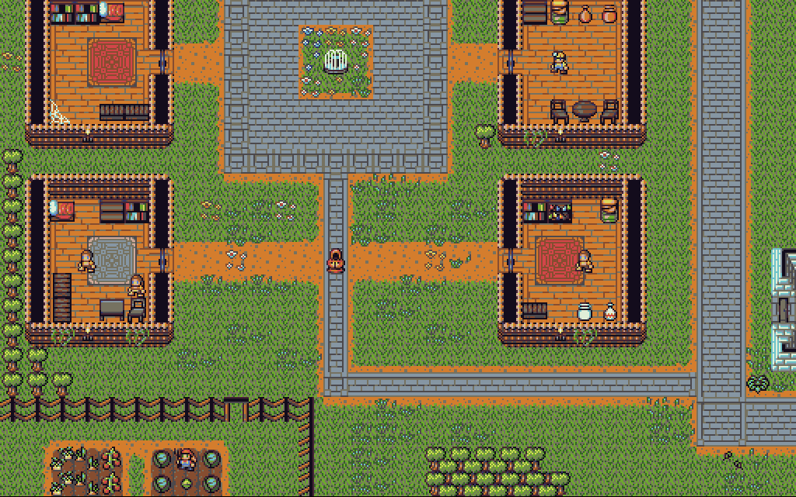

# Rotten Soup

###### A roguelike written in JavaScript with Vue, [Vuetify](https://vuetifyjs.com/en/), [ROT.js](http://ondras.github.io/rot.js/hp/) and [PixiJS](http://www.pixijs.com/).

While maintaining some roots in traditional roguelike gameplay with features like randomly generated dungeons, turn-based combat and permadeath, Rotten Soup also has many modern features such as tiled graphics, animations, a statically defined overworld, and mouse controls. Since Rotten Soup is developed using JavaScript, you can play it in your browser [here](https://rottensoup.herokuapp.com)!

## Features

* [x] Three detailed areas that you can explore. The Mulberry Town, Forest & Graveyard
* [x] Randomly generated dungeons with different themes every 5 floors with unique enemies and loot
* [x] A tough mini-boss that can raise the dead
* [x] Dozens of unique villagers!
* [x] Melee, Magic, and Ranged combat
* [x] Wide variety of playable characters
* [x] Potions, swords, keys, and spellbooks!
* [ ] Quests
* [ ] Dialog and interaction with NPC's
* [ ] Shops where you can sell/buy items
* [ ] Unique characters classes, skills, and abilities
* [ ] More weapons (Axes, Polearms, Bows, Staves, Morningstar, Whips, Daggers, Clubs, Spears)
* [ ] More challenging enemy types
* [ ] Enemies that used ranged and magical attacks

## Completed but not currently used

* [x] Procedurally generated worlds not unlike Minecraft
* [x] Weapon enchantments

## Contact / Feedback

If you have any feedback, please send me an email at larkenx@gmail.com or drop an issue on GitHub. Any feedback is welcome and greatly appreciated.
