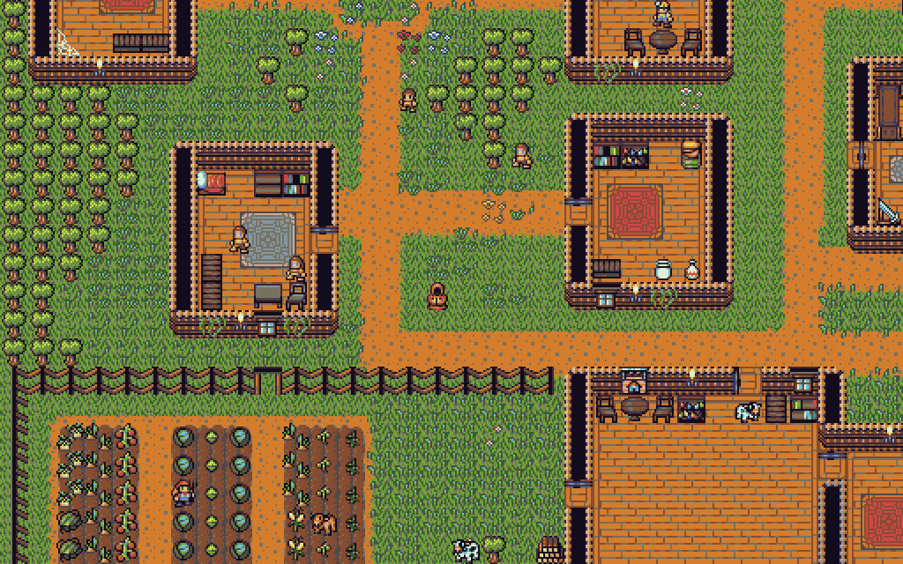

# Rotten Soup
###### A roguelike written in JavaScript with [Vue](https://vuejs.org/), [Vuetify](https://vuetifyjs.com/en/), [Tiled](https://www.mapeditor.org/), [rot.js](http://ondras.github.io/rot.js/hp/) and [PixiJS](http://www.pixijs.com/).



While maintaining some roots in traditional roguelike gameplay with features like randomly generated dungeons, turn-based combat and permadeath, Rotten Soup also has many modern features such as tiled graphics, animations, a statically defined overworld, and mouse controls. Since Rotten Soup is developed using JavaScript, you can play it in your browser [here](https://rottensoup.herokuapp.com)!

## Features
* [x] Three detailed areas that you can explore. The Mulberry Town, Forest & Graveyard
* [x] Randomly generated dungeons with different themes every 5 floors with unique enemies and loot
* [x] A tough mini-boss that can raise the dead
* [x] Dozens of unique villagers!
* [x] Melee, Magic, and Ranged combat
* [x] Wide variety of playable characters
* [x] Potions, swords, keys, and spellbooks!
* [x] Quests
* [x] Dialog and interaction with NPC's
* [x] Procedurally generated worlds not unlike Minecraft
* [x] Weapon enchantments
* [x] Goal-based enemies

## Running the game locally
To run Rotten Soup locally, you can clone this repository and install its dependencies with `yarn`. You will probably need to install `vue-cli`.

```
npm install -g @vue/cli
# OR
yarn global add @vue/cli
```

To Install other Dependencies
```
npm i
# or
yarn
```

To Run in Desktop
```
npm run desktop
# or
yarn desktop
```

To Run as Web App
```
npm run serve
# or
yarn serve
```

## Contact / Feedback

If you have any feedback, please send me an email at larkenx@gmail.com or drop an issue on GitHub. Any feedback is welcome and greatly appreciated.

We now have a [Discord](https://discord.gg/dwtUY9N)! So come check out the Community!❤️

## Donate
If you've really enjoyed my game and want to buy me a cup of coffee, I won't stop you!

[](https://www.paypal.me/larkenx)
