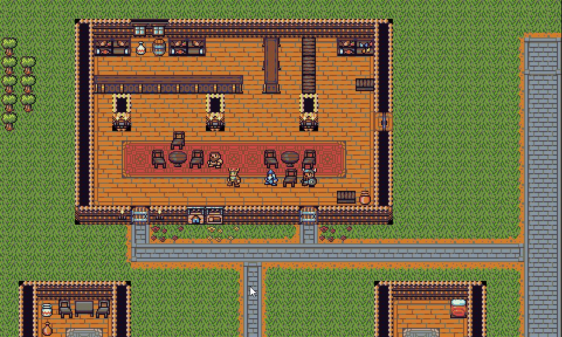

# Rotten Soup


Rotten Soup is roguelike written in JavaScript with [rot.js](http://ondras.github.io/rot.js/hp/). My goal was to create a really robust
data representation for all game entities using ES6 classes. I used [Vue.js](https://vuejs.org/) and [Vuetify](https://vuetifyjs.com/) to build a reactive UI, which made displaying game information very easy. In the [v.0.1-alpha release](https://github.com/Larkenx/Rotten-Soup/releases/tag/v.0.1-alpha) of Rotten Soup, I used bare-bones JQuery and W3CSS to update game information to the UI, but it was clunky and in desperate need of a template engine!

# Controls
- Movement is 8-directional using either the numpad or vim keys.
```
         y k u   7  8  9
         \ | /    \ | /
         h-+-l    4-5-6
         / | \    / | \
         b j n    1 2 3
         vi-keys   numpad
```

- You can move up and down ladders using `>` (down) and `<` (up).
- You can rest for a turn with `.`
- You can pick up items with `,` or `g`.

# Current Features
*Note: A lot of the features below (like dungeon generation and FOV) come from built-in ROT.js methods*
- Field of view / Fog of war
- Minimap, revealed as you explore
- Static overworld map
- Randomly generated dungeons
- Transitions between overworld and dungeons with persistent maps
- Inventory system and items
- Simple AI for Goblins and Rats

